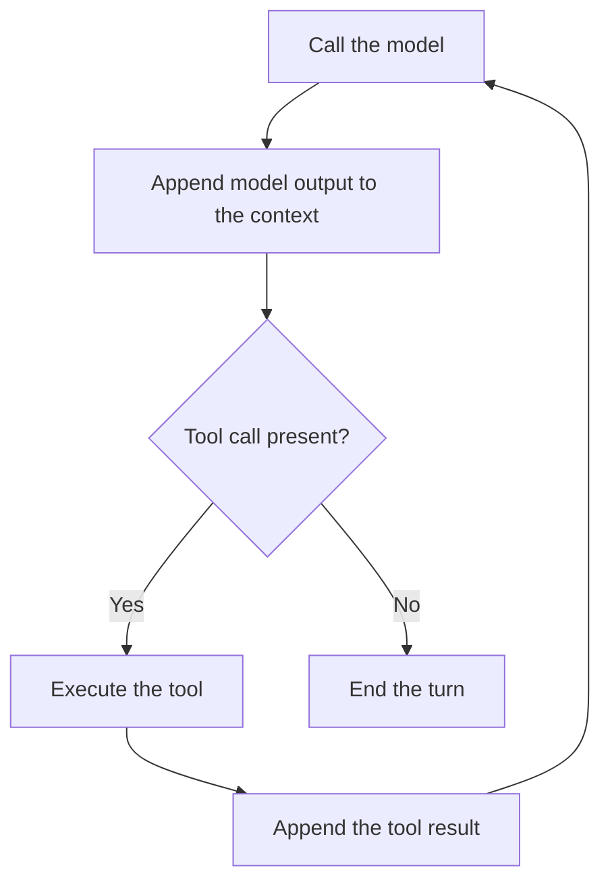

# The Essence of AI Agents

AI agents search the web, write code, analyze files, run tests, and sometimes work on a single task for hours.

Because this feels like one coherent, intelligent system, it is easy to assume that the model itself has all these abilities.

But that’s not the case. The search runs in a search engine. Code runs in a separate process. Files are opened by software. The large language model (LLM) generates text, which the surrounding software interprets as commands to perform these actions.

The software connecting these components is the **agent harness**.

What makes agents interesting is how much can emerge from such simple parts. In this series, we will build a harness step by step, starting with the model's most basic operation.

## At the bottom is text completion

Consider this sentence:

> The capital of France is

What is the next word?

You probably thought of Paris. You have just performed roughly the task an autoregressive language model is trained to do.

More precisely, the model predicts the next **token**. A token can be a whole word, part of a word, punctuation, or a space together with another piece of text.

For a sequence of tokens $t_1, t_2, \ldots, t_n$, the prediction takes the form:

$P(t_{n+1} \mid t_1, t_2, \ldots, t_n)$

This is the probability of the next token given all the preceding tokens. For our sentence, an illustrative distribution might be:

```text
" Paris"        97.8%
" Lyon"          0.7%
" Marseille"     0.3%
" located"       0.2%
" a"             0.1%
everything else  0.9%
```

The model calculates a probability for each possible next token. These probabilities guide the selection: we can select the most likely token, or use randomness to choose a less likely one for greater exploration. Parameters like `temperature` control how much randomness is involved.

The selected token is appended to the text. From:

```text
The capital of France is
```

we get:

```text
The capital of France is Paris
```

The model then predicts again, using this longer input:

```text
The capital of France is Paris,
```

And again:

```text
The capital of France is Paris, which
```

This repeats until a stopping condition is reached. We call this process **text completion**, and the text available for each prediction is the model's **context**.

Nothing in this operation requires the text to be a conversation with an assistant. Consider a **base model**, trained to predict text but not yet trained to act as an assistant. Given:

```text
"Hi, how are you?
```

it might continue a scene from a novel:

```text
"Hi, how are you?" Anna asked as she opened the door.

Tom shrugged. "Fine. Just a little tired."

"Long day?"

"You have no idea."
```

This is a plausible continuation of the greeting. The input gives the model no reason to treat it as a message addressed to an AI assistant; it could just as well be dialogue in a novel.

How can we make an assistant’s reply the likely continuation?

## A chat is a learned form of text completion

A language model's training data contains dialogues like the one between Anna and Tom. To continue them, it has to learn how different speakers, perspectives, and conversational patterns fit together.

We can use that ability by writing a conversation whose next speaker is an assistant:

```text
# AI & Human Interactions

AI language models have become helpful assistants to humans.

The following is a conversation between a human and such an AI model.
Human messages are wrapped in <user> tags.
AI responses are wrapped in <model> tags.

<chat>
<user>
Hi, how are you?
</user>
<model>
```

When you read “The following is a conversation between a human and such an AI model,” you expect the text that follows to contain their dialogue. The model has learned that same connection from training on text: an introduction sets up what is likely to follow.

That is what our **prefix** does. It frames the user’s greeting as the beginning of a chat with an AI assistant. Completing that text now means continuing the chat, with the open `<model>` block marking where the assistant’s reply begins.

```xml
I'm doing well, thanks! How can I help?
</model>
```

But the same pattern can carry it past the reply and into an invented user message:

```xml
I'm doing well, thanks! How can I help?
</model>
<user>
Explain how neural networks work.
</user>
<model>
Neural networks are ...
```

To leave the next turn to the real user, the harness uses `</model>` as a **stop sequence**. Generation ends at that boundary, and the harness displays the contents of the model's message. When the user replies, it appends their message and opens another `<model>` block.

## System instructions belong to the same prefix

You may have heard of **system instructions** or **system messages**. They can seem like a special interface into the model itself, where we can program its identity, rules, and behavior separately from the conversation.

But they rely on the same simple technique we already used—describing the assistant in the text the model continues—with additional training to make it follow those instructions more reliably.

We can extend our prefix with a description of that role:

```text
# AI & Human Interactions

[Previous instructions]
...

The AI model follows these instructions:

<system>
You are a precise and helpful AI assistant.

Follow the user's instructions carefully.
Explain technical concepts from first principles.
Do not claim to have performed actions you have not performed.
</system>

<chat>
```

The instructions become part of the input on which the model bases its next predictions, alongside the conversation.

Modern models use special role markers, and further training teaches them to give system instructions priority over ordinary user messages. Their special treatment is learned from that training; the instructions still enter through the model's context.

## A tool call starts as text too

Our chatbot can generate a reply, but some questions require information outside its input and training data. To answer who currently leads a company, for example, it may need to search the web.

Suppose we have a function that takes a search query and returns results. The harness can call it, but how can the model request that call through text?

We can define a format: a query between `<webSearch>` tags means a search request, while `<text>` tags contain an ordinary reply. The harness can then extract the query and pass it to the search function. A function made available to the model this way is called a **tool**.

We describe this format in the prefix:

```text
Inside <model>, wrap each part of your output in one of these tags:

<text>
The response to the human
</text>

<webSearch>
The search query
</webSearch>
```

The model could produce:

```xml
<text>
I'll check.
</text>
<webSearch>
current CEO of Example Corporation
</webSearch>
```

These tags are still generated text. At `</webSearch>`, the query is complete, but answering requires results we do not have yet. The harness therefore stops generation, closes the current `<model>` block, and passes the query to the actual search function:

```ts
const results = await webSearch(
  "current CEO of Example Corporation",
);
```

Suppose the function returns:

```json
[
  {
    "title": "Example Corporation Leadership",
    "url": "https://example.com/leadership",
    "snippet": "The company is led by ..."
  }
]
```

For the model to use these results, they must enter its input. We append them in a separate `<webSearchResults>` block and identify that block in the prefix as results supplied by the harness. The conversation becomes:

```xml
<user>
Who is currently the CEO of Example Corporation?
</user>

<model>
<text>
I'll check.
</text>
<webSearch>
current CEO of Example Corporation
</webSearch>
</model>

<webSearchResults>
[
  {
    "title": "Example Corporation Leadership",
    "url": "https://example.com/leadership",
    "snippet": "The company is led by ..."
  }
]
</webSearchResults>

<model>
```

We call the model with this updated input. It can request another search if needed, or answer using the result:

```xml
<text>
According to the company's official website, Example Corporation is led by ...
</text>
</model>
```

## Continuing generation means calling the model again

The model did not pause and keep thinking while the search ran. Its first call ended at the search request. The harness then constructed the input for a second call:

```text
Previous context
+ Model output
+ Tool result
= New context
```

The model itself has no conversational state between these calls. Anything from this interaction that it needs for the next response must be supplied again. What looks like one continuous conversation depends on the harness carrying that information forward.

Each call can accept only a limited number of tokens, called the **context window**. As the conversation grows, the harness eventually has to shorten or summarize the context to stay within that limit.

## From web search to arbitrary tools

Searching is one possible action. Running code or changing a chat title requires different functions and arguments. To let the model choose among them, we describe the available functions in the prefix. Each needs a name to identify it, a description of what it does, and an argument **schema** specifying the expected fields and types:

```text
The model has access to the following tools:

webSearch:
  description: Search the web for current or external information.
  args: { query: string }

executeCode:
  description: Execute code in an isolated environment.
  args: { code: string, language: "ts" | "py" }

setChatTitle:
  description: Set the title of the current chat.
  args: { title: string }
```

The request must now identify the chosen tool as well as its arguments. We replace `<webSearch>` with a general `<tool_call>` block containing those two fields. A request to execute code could look like this:

```xml
<tool_call>
{
  "tool": "executeCode",
  "args": {
    "code": "print(2 + 2)",
    "language": "py"
  }
}
</tool_call>
```

At `</tool_call>`, the harness stops generation and parses the request. It uses the name to find the function in its **tool registry**, the mapping from names to implementations, and calls it with the supplied arguments:

```ts
const result = await tools.executeCode({
  language: "py",
  code: "print(2 + 2)",
});
```

The result enters the context in a general `<tool_call_result>` block:

```xml
</model>

<tool_call_result>
{
  "output": "4\n",
  "exitCode": 0
}
</tool_call_result>

<model>
```

The next model call can use this output just as it used the search results. Additional tools fit the same request-and-result format, so adding a capability does not require a different interaction mechanism.

## Modern APIs handle this protocol

Our XML examples expose how the input and output fit together. Modern model APIs provide a structured interface for the same exchange: we supply system instructions, conversation messages, and tool definitions as separate data.

The provider encodes them in the model's trained format, using special tokens in place of our XML tags. Post-training teaches the model to use that format and respond as an assistant. The API returns structured output such as text or a tool call, leaving the harness to execute the requested function.

## The agent loop

A tool result can reveal the need for another action. A coding agent might read a file, change the code, run tests, and discover an error that requires another change. The next action depends on the previous result.

We therefore repeat the exchange for as long as the model requests a tool. A response that ends without another request finishes the work for the current user message.

We call this work a **turn**. Each further model call after a tool result is a **continuation**; the response that ends the turn is **terminal**.



This is the **agent loop**. We started with next-token prediction, used a conversation prefix to turn it into chat, and added a format for requesting actions. By executing those requests and supplying their results to the next model call, the harness turns text completion into a working process.

The [next chapter](02_agent-loop.md) implements this loop in TypeScript.
